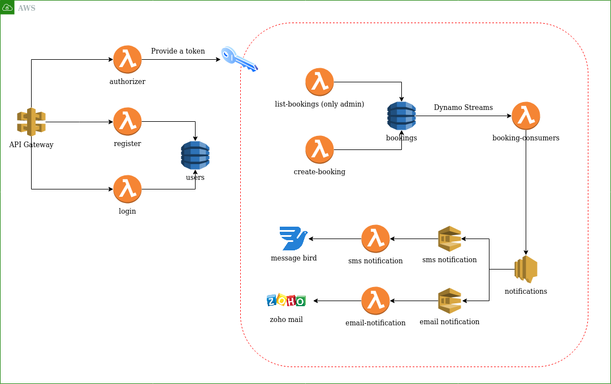

## AWS Cloud-Native Application with Terraform and Serverless Framework

### Environments

| Environment | Key  |
| ----------- | ---- |
| Development | dev  |
| Production  | prod |

### How to deploy infrastructure

`sh deploy.sh ${environment-key}`

### How to destroy infrastructure

`sh deploy.sh ${environment-key}`

## Architecture

The project is built as follows:

